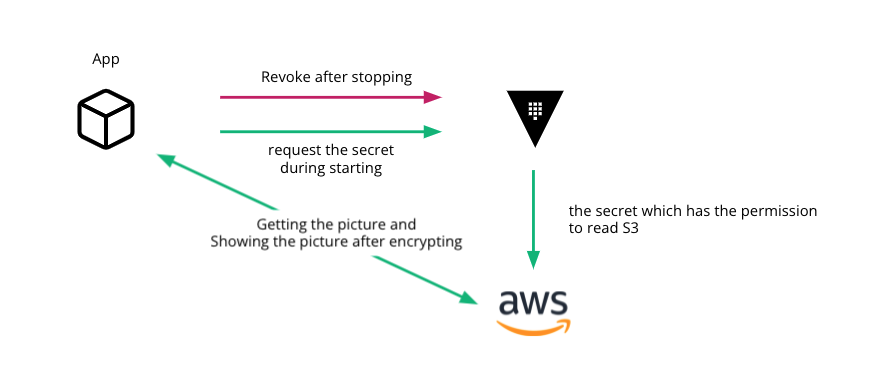
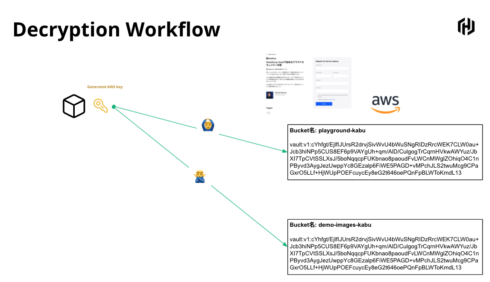
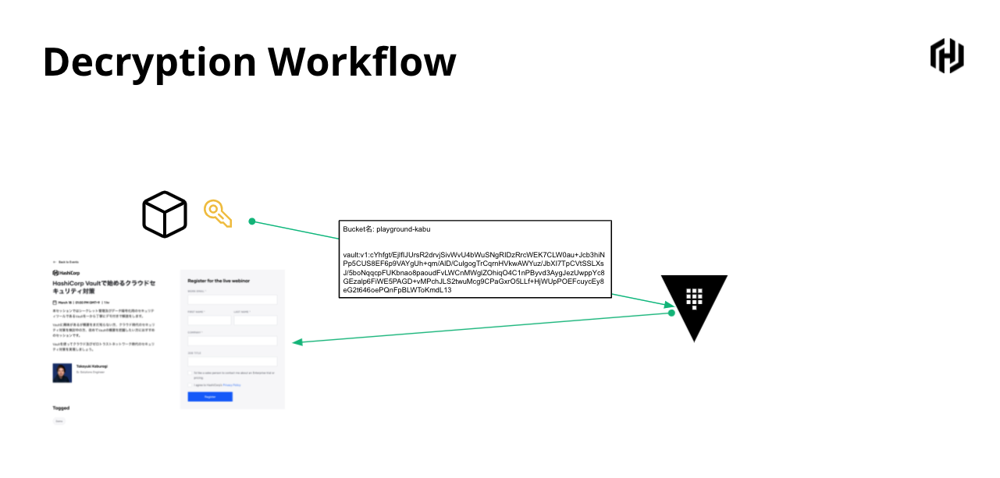

```shell script
vault secrets enable transit
vault write transit/keys/aes256
```

* Encrypt the picture
* Save your picture to S3 object storage. Sorry, the name of the buckey should be `playground-kabu` and `demo-images-kabu` and the name of file should be `encrypted-image`. These are hardcoded in the source

```json
{
  "Version": "2012-10-17",
  "Statement": [
    {
      "Effect": "Allow",
      "Action": [
        "s3:GetObject",
        "s3:ListBucket"
      ],
      "Resource": "arn:aws:s3:::playground-kabu/*"
    }
  ]
}
```

```hcl
path "aws/creds/read-s3" {
  capabilities = [ "read" ]
}

path "aws/roles/*" {
  capabilities = [ "list", "read" ]
}

path "transit/*" {
  capabilities = [ "read", "create", "list", "update", "delete" ]
}
```

```
vault policy write read-s3-transit read-s3-transit.hcl
```


```
kubectl exec -ti vault-0 /bin/sh

vault operator init

vault auth enable kubernetes

vault write auth/kubernetes/config \
   token_reviewer_jwt="$(cat /var/run/secrets/kubernetes.io/serviceaccount/token)" \
   kubernetes_host=https://${KUBERNETES_PORT_443_TCP_ADDR}:443 \
   kubernetes_ca_cert=@/var/run/secrets/kubernetes.io/serviceaccount/ca.crt

vault write auth/kubernetes/role/read-s3-transit \
   bound_service_account_names=demoapp \
   bound_service_account_namespaces=default \
   policies=read-s3-transit  \
   ttl=1h
```

## Test

Browse: 
  * `/playground-kabu`
  * `/demo-images-kabu`
  * 

[annotaions](https://www.vaultproject.io/docs/platform/k8s/injector/annotations)
